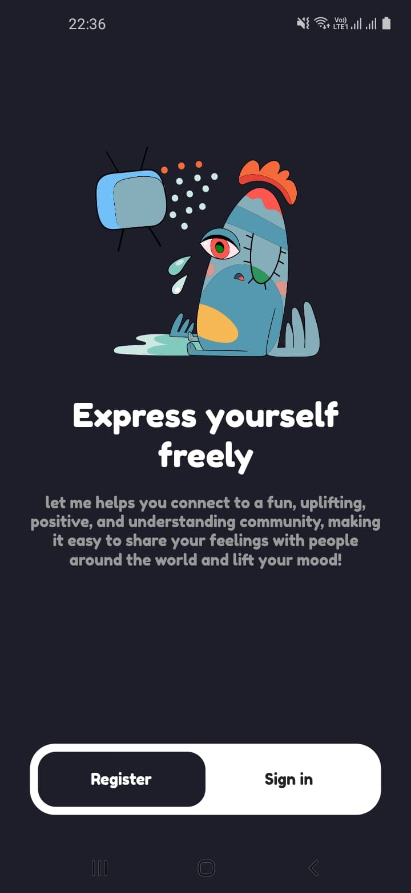

# Lullaby MiniProject
Lullaby is social network for Vent your feelings

# THIS IS MINIMAL VIABLE PRODUCT(MVP)
## FONTEND
Flutter

## BACKEND
Express.js(TypeScript OOP)
### AUTH
JWT
### Database
Mongodb
### Architecture 
Monolith to => Simple Microservice (but use same db)
### VM / CONTAINER
Docker
### Web service
NginX (API Gateway)

